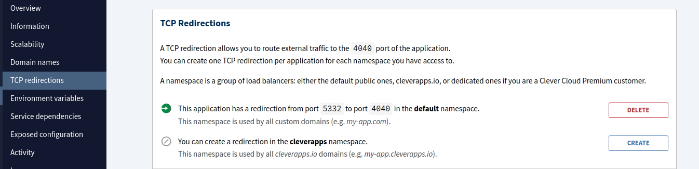
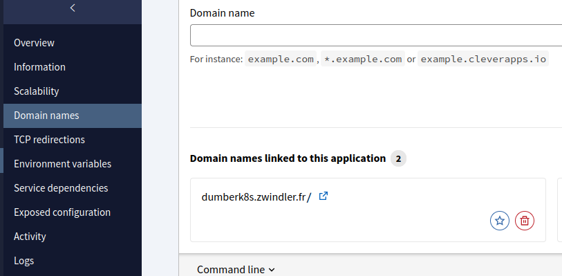

# dumber-k8s

The most dumb k8s control plane implementation you're gonna find. I'm using the "linux" app type (https://www.clever-cloud.com/developers/doc/applications/linux/) from clever cloud to start a whole Kubernetes control plane.

Now, couple of restrictions. In order to expose the self generated TLS encrypted api-server, you have to enable TCP redirection, which listens on port 4040 and exposes port 5332 on your clever cloud app URL.

```bash
clever tcp-redirs --app xxx_xxxxxxxx-xxxx-xxxx-xxxx-xxxxxxxxxxxx
```

or from the console:



Also, since Clever Cloud expects you to run a HTTP application on 8080 port, I also added a dump python3 webserver that listens on port 8080 to avoid this message:

```
2025-07-18T19:50:58.165Z Nothing listening on 0.0.0.0:8080 yet. If the deployment fails after this message, please update your configuration and redeploy.
```

I'm doing it just for fun. Don't use it. Even for personal use...

## Installation

Just clone or copy this repository. If you want to access this remotely, change the URL `dumberk8s.zwindler.fr` to a domain you control.

Deploy the repo on clever cloud with a "linux" type app. Again, if you want to use it remotely, add the domain in the app settings (this requires having access to a domain and DNS CNAME records).



Note: you can probably just use app-d46c60de-a229-49c9-8759-b3a829c1e6d1.cleverapps.io default clever cloud URL but I haven't tried.

Start the app.

[Mise](https://mise.jdx.dev/registry.html) should install some dependencies (cfssl, etcd, kubectl, python) and `./setup-binaries.sh` should do the rest. After 30ish seconds you should get :

```
...
2025-07-18T19:54:39.255Z 🌐 Step 9: Starting additional services...
2025-07-18T19:54:39.260Z === Starting additional services ===
2025-07-18T19:54:39.260Z Starting HTTP server on port 8080...
2025-07-18T19:54:39.260Z HTTP server started with PID: 2133
2025-07-18T19:54:39.260Z ✓ Additional services started
2025-07-18T19:54:39.260Z HTTP server available at: http://0.0.0.0:8080
2025-07-18T19:54:39.262Z ✅ Kubernetes cluster setup complete!
...
```

Control plane is up and running.

## Try the control plane

As it is, the control plane in itself is useless. BUT we can SSH connect to the clever cloud "linux" instance and try to run some `kubectl` commands to see it it really works

1. login your terminal

```bash
$ clever login

Opening https://console.clever-cloud.com/cli-oauth?cli_version=3.13.1&cli_token=xxxxxxxxxx in your browser to log you in…
We're still waiting for the login process (in your browser) to be completed…
Login successful as Denis Germain <blog@zwindler.fr>
```

2. Link the repo to the app.

If that's not already done, link your repo to the app in clever cloud

```bash
$ clever link <app_id>
✓ Application app_xxxxxxxx-xxxx-xxxx-xxxx-xxxxxxxxxxxx has been successfully linked!
```

Once this is done, a .clever.json file is created

```json
{
  "apps": [
    {
      "app_id": "app_xxxxxxxx-xxxx-xxxx-xxxx-xxxxxxxxxxxx",
      "org_id": "user_xxxxxxxx-xxxx-xxxx-xxxx-xxxxxxxxxxxx",
      "deploy_url": "https://github.com/zwindler/your-app-name.git",
      "git_ssh_url": "https://github.com/zwindler/your-app-name.git",
      "name": "your-app-name",
      "alias": "your-app-name"
    }
  ]
}
```

You can now SSH to the instance

```bash
$ clever ssh
Opening an ssh shell.
Warning: Permanently added '[203.0.113.30]:28925' (ED25519) to the list of known hosts.
Last login: Fri Jul 18 20:17:00 UTC 2025 on pts/0

bas@12cf3e9e-e070-485d-a548-f6b6cee5ab9b ~ $ pwd
/home/bas
```

Navigate to the app_something dir, and you'll find your repository files

```bash
bas@12cf3e9e-e070-485d-a548-f6b6cee5ab9b ~ $ cd app_d46c60de-a229-49c9-8759-b3a829c1e6d1/
bas@12cf3e9e-e070-485d-a548-f6b6cee5ab9b ~/app_d46c60de-a229-49c9-8759-b3a829c1e6d1 $ ls
admin.conf                   generate-certs.sh          setup-kubeconfig.sh
bin                          generate-external-node.sh  setup-node-rbac.sh
bootstrap-token.txt          generate-worker-script.sh  setup-worker-node.sh
bootstrap-token.yaml         mise.toml                  start-control-plane.sh
certs                        node-bootstrap-rbac.yaml   start-etcd.sh
etcd-data                    README.md                  start-services.sh
generate-bootstrap-token.sh  setup-binaries.sh
```

Set KUBECONFIG and try a `kubectl` command

```
bas@12cf3e9e-e070-485d-a548-f6b6cee5ab9b ~/app_d46c60de-a229-49c9-8759-b3a829c1e6d1 $ export KUBECONFIG=admin.conf

bas@12cf3e9e-e070-485d-a548-f6b6cee5ab9b ~/app_d46c60de-a229-49c9-8759-b3a829c1e6d1 $ kubectl version
Client Version: v1.33.2
Kustomize Version: v5.6.0
Server Version: v1.33.2
```

Hurray!! We are running a Kubernetes control plane on Clever Cloud.

You can also copy the admin.config file locally, and change the `server: https://127.0.0.1:4040` to `server: https://dumberk8s.zwindler.fr:5332` and it should work as well.

```bash
$ kubectl cluster-info
Kubernetes control plane is running at https://dumberk8s.zwindler.fr:5332

To further debug and diagnose cluster problems, use 'kubectl cluster-info dump'.
```

But can we use it to **run anything**?

## Add a worker

I can't use the **linux** clever cloud app to create a worker (that would mean installing containerd or another container runtime and I don't think I have enough privileges). But any IaaS VM will do and that's what the helper script is for.

If you've looked at the app logs, you may have seen 2 things of interest:

```
#at step 7
2025-07-18T19:54:39.208Z ✓ Bootstrap token created: xxxxxx.xxxxxxxxxxxxxxxxxxxxxxxx
2025-07-18T19:54:39.208Z Token saved to: bootstrap-token.txt
2025-07-18T19:54:39.208Z 🔑 Bootstrap token: xxxxxx.xxxxxxxxxxxxxxxxxxxxxxxx
2025-07-18T19:54:39.208Z Save this token - you'll need it for worker node setup!
...
#after step 9
2025-07-18T19:54:39.262Z 📋 To add worker nodes:
2025-07-18T19:54:39.262Z   1. Check the generated setup-worker-node.sh script
2025-07-18T19:54:39.262Z   2. Copy it to your external worker node
2025-07-18T19:54:39.262Z   3. Edit NODE_NAME and NODE_IP in the script
2025-07-18T19:54:39.262Z   4. Run it with sudo privileges
```

Now, since we have the bootstrap token and the CA and an external endpoint for the API server, we could enrole a node by hand. 

BUT, if step 8 worked correctly, everything you need to start a new worker node and enrole it to our control plane is already generated:

```bash
$ cat setup-worker-node.sh 
#!/bin/bash

# External Worker Node Setup Script for Kubernetes
# Run this script on your external worker node

set -e

# Configuration - EDIT THESE VALUES
NODE_NAME="worker-1"  # Change this to your node name
NODE_IP="YOUR_NODE_IP"  # Change this to your external node IP
API_SERVER_ENDPOINT="https://dumberk8s.zwindler.fr:5332"
BOOTSTRAP_TOKEN="xxxxxx.xxxxxxxxxxxxxxxxxxxxxxxx"  # Replace with actual token
K8S_VERSION="1.33.2"
...
```

Just copy paste is to a linux VM capable of running kubelet and containerd and you should be good to go.

## Future work

If I continue to find this project funny, I might add missing binaries to mise by creating aqua or ubi packages for `cfssljson` and `kube-.*`, eliminating the need to curl the binaries myself in `setup-binaries.sh`.

I'll improve documentation to include CLI **and** console options everytime.

Should clever cloud ever release the MateriaDB etcd shim, I may also add an option to use it as an external database. This will allow us to create more replicas of the control plane, thus paving the way to a highly available "dumber k8s". That would be awesome.

Optionnaly, I could try to use kine to use existing external DBaaS from clever cloud to achieve the same goal.

